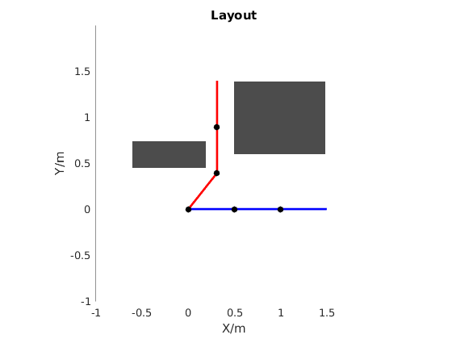
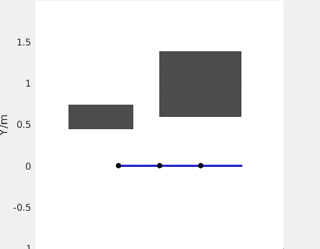
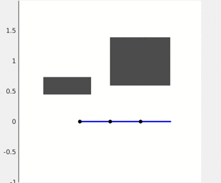

Example: A simple 2D Matlab example 
===================================================
We start with a very simple Matlab example, with a 3-link planer arm avoiding obstacles. 
Make sure you have properly installed gpmp2 with Matlab toolbox, and added the toolbox path to Matlab paths.
The full example is available at [matlab/Arm3PlannerExample.m](../matlab/Arm3PlannerExample.m).

Dataset
-----
The generate2Ddataset utility function will generate a dataset object that includes the ground truth 2D occupancy grid, 
cell size of the occupancy grid, and the occupancy grid origin (in gtsam.Point2 object) in world coordinate frame.

```matlab
%% small dataset
dataset = generate2Ddataset('TwoObstaclesDataset');
```

Signed Distance Field
-----
After generating datasets, the signed distance field can be calculated from the ground truth occupancy grid.

In 2D cases, the signed distance field is just a matrix. Matrix column index represents X direction, 
and row index represents Y direction.
The origin is the position of cell (1,1) in the matrix.
A [PlanarSDF](../gpmp2/obstacle/PlanarSDF.h) object which stores the signed distance field is initialized as follows:

```matlab
% signed distance field
field = signedDistanceField2D(dataset.map, cell_size);
sdf = PlanarSDF(origin_point2, cell_size, field);
```

Robot Arm
-----
A simple 3-link arm in an ArmModel object can be generated from Matlab generateArm utility function for convenience:

```matlab
% arm model
arm = generateArm('SimpleThreeLinksArm');
```

[ArmModel](../gpmp2/kinematics/ArmModel.h) class consists of a forward kinematics model (DH parameter arm implemented by [Arm](../gpmp2/kinematics/Arm.h) class) 
and a physical arm represented by a series of spheres (implemented by [BodySphereVector](../gpmp2/kinematics/RobotModel.h) class). 
Details can be found in [generateArm.m](../matlab/+gpmp2/generateArm.m).

We can now visualize the dataset setting and start/goal configurations in Matlab

|**Figure 1:** WAM arm dataset visualized in Matlab, with start (blue) and end (red) configuration.|
|:-----------|
||

Initialize the Trajectory
-----

To start the iterative non-linear least square optimization, we need to give an initial trajectory.
Here we initialize the trajectory as straight line in configuration space. The initial trajectory should be stored in a gtsam.Values object. 
GPMP2 provides a utility function [initArmTrajStraightLine](../gpmp2/planner/TrajUtils.h) to initialize straight line given start/end configuration, 
and total number of states/waypoints for optimization.

```matlab
%% init values
init_values = initArmTrajStraightLine(start_conf, end_conf, total_time_step);
```

Parameters
-----
All the trajectory optimization related parameters are stored in [TrajOptimizerSetting](../gpmp2/planner/TrajOptimizerSetting.h) class. 
Please check [parameters](Parameters.md) page for details on tuning/setting these parameters. 

```matlab
%% optimization settings
opt_setting = TrajOptimizerSetting(3);          % initialization with DOF
opt_setting.set_total_step(total_time_step);    % total number of states/waypoints for optimization
opt_setting.set_total_time(total_time_sec);     % total runtime (second) of the trajectory
opt_setting.set_epsilon(epsilon_dist);          % \epsilon for hingeloss function, see the paper
opt_setting.set_cost_sigma(cost_sigma);         % \sigma_obs for obstacle cost, see the paper
opt_setting.set_obs_check_inter(check_inter);   % number of waypoints are checked by GP interpolation, 0 means GP interpolation is not used
opt_setting.set_conf_prior_model(pose_fix_sigma); % start/end pose prior sigma, leave as default (0.0001) for most cases
opt_setting.set_vel_prior_model(vel_fix_sigma); % start/end velocity prior sigma, leave as default (0.0001) for most cases
opt_setting.set_Qc_model(Qc);         % GP hyperparameter
opt_setting.setGaussNewton();         % optimization method
```

Optimization
-----
Factor graph generation and optimization are performed in [BatchTrajOptimize2DArm](../gpmp2/planner/BatchTrajOptimizer.h) function. The BatchTrajOptimize2DArm needs input of arm model, signed distance field, start/end configuration+velocity, 
initial trajectory values, and parameters.

```matlab
% optimize!
result = BatchTrajOptimize2DArm(arm, sdf, start_conf, start_vel, end_conf, end_vel, init_values, opt_setting);
```

Densify the Trajectory by GP Interpolation (Optional)
-----
If you need dense trajectory for robot execution, you can densify the trajectory by GP Interpolation. 
GPMP2 provides a utility function [interpolateArmTraj](../gpmp2/planner/TrajUtils.h) to densify the trajectory using GP Interpolation and by providing optimized values, GP hyperparameter, time interval between states, and number of points you would like to interpolate between each two states (0 means not interpolation).

```matlab
plot_values = interpolateArmTraj(result, Qc_model, delta_t, plot_inter-1);
```

Display
-----
Once optimized trajectory values are available, we can query the configuration and plot the arm. 
The configuration vector can be queried from a gtsam.Values object by ```plot_values.atVector(symbol('x', i));```,
where ```i``` is the index of the state you query (starting from 0 and ending at ```opt_setting.total_step```). 
Then [plotPlanarArm](../matlab/+gpmp2/plotPlanarArm.m) is used to plot the arm

```matlab
% plot arm
conf = plot_values.atVector(symbol('x', i));
plotPlanarArm(arm.fk_model(), conf, 'b', 2);
```

Here's the output results of non-densified and densified trajectory

|**Figure 2:** Non-densified trajectory for 2D 3-link arm example.|
|:-----------|
||

|**Figure 3:** Densified trajectory for 2D 3-link arm example.|
|:-----------|
||
