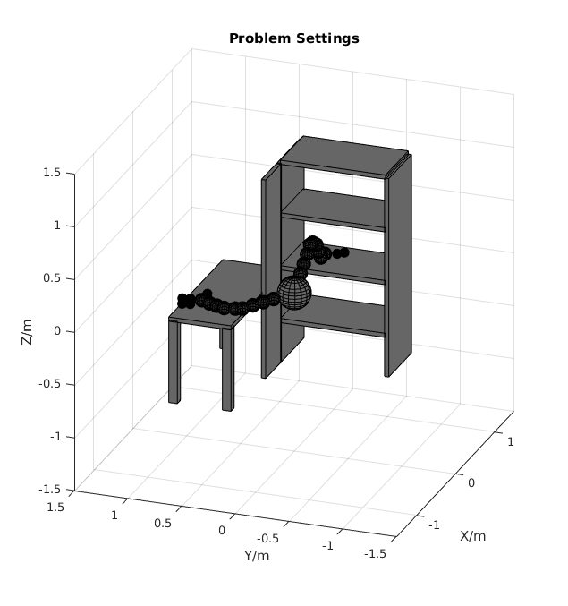
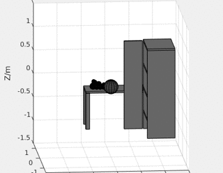
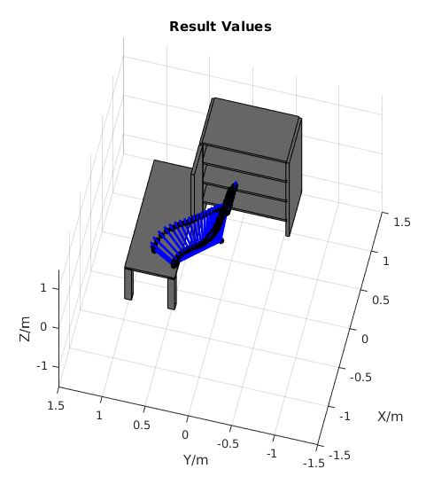

Example: A real-world 3D Matlab example 
===================================================
After the 2D example, we look at a 3D matlab example. The code can be found in  [matlab/WAMPlannerExample.m](../matlab/WAMPlannerExample.m).

Dataset
-----
The generate3Ddataset utility function will generate a 3D dataset object that includes the ground truth 3D occupancy grid, 
cell size of the occupancy grid, and the occupancy grid origin (in gtsam.Point3 object) in world coordinate frame.

```matlab
% dataset
dataset = generate3Ddataset('WAMDeskDataset');
```

To plot the 3D scene and arm with spheres model, use plotMap3D and plotRobotModel.
set3DPlotRange function is used to setup and correct coordinate limits.

```matlab
% plot problem setting
figure(1), hold on
title('Problem Settings')
plotMap3D(dataset.corner_idx, origin, cell_size);
plotRobotModel(arm, start_conf)
plotRobotModel(arm, end_conf)
% plot config
set3DPlotRange(dataset)
grid on, view(3)
hold off
```

|**Figure 1:** WAM arm dataset visualized in Matlab, with start and end configuration.|
|:-----------|
||

Signed Distance Field
-----
The signed distance field in 3D cases is different from 2D cases. 
In matlab, the calculated 3D signed distance field is a 3-dimensional matrix, where
the first dimension represents X direction, second dimension represents Y,
and third one represents Z.

```matlab
% init sdf
field = signedDistanceField3D(dataset.map, dataset.cell_size);
```

A [SignedDistanceField](../gpmp2/obstacle/SignedDistanceField.h) object 
which stores the signed distance field is then initialized.
Inside SignedDistanceField, the 3D signed distance field is stored in a vector of matrices.
```cpp
class SignedDistanceField {
  ...
  // sdf data
  std::vector<gtsam::Matrix> data_;
  ...
```
Each matrix represents a X-Y 'slice' of signed distance field, and vector index represents the Z direction.
So when we initialize SignedDistanceField object from Matlab 3-D matrix, 
we get each 2-D layer matrix from Matlab 3-D matrix, and initialize each slice of SignedDistanceField.

```cpp
class SignedDistanceField {
  ...
  /// insert data matrix to each layer of sdf
  /// @param z_idx the z index of 3-D sdf
  /// @param field_layer matrix of each slice of 3-D sdf, Matrix represent the X (col) & Y (row)
  void initFieldData(size_t z_idx, const gtsam::Matrix& field_layer) {
  ...

```
Note that for each X-Y 'slice' matrix, column index represents X direction, and row index represents Y direction, 
whose sequence is reversed compared to 3-D Matlab matrix,
so when initializing SignedDistanceField slice, a transpose is needed. 

```matlab
sdf = SignedDistanceField(origin_point3, cell_size, size(field, 1), ...
    size(field, 2), size(field, 3));
for z = 1:size(field, 3)
    sdf.initFieldData(z-1, field(:,:,z)');
end
```

Results
-----
Other than dataset and signed distance field calculation, remaining of the 3D example is quite similar to the 2D example.
You can refer to [matlab/WAMPlannerExample.m](../matlab/WAMPlannerExample.m) for further details. 

|**Figure 2:** WAM arm example results visualized in Matlab, animation.|
|:-----------|
||

|**Figure 3:** WAM arm example results visualized in Matlab, static trajectory|
|:-----------|
||
