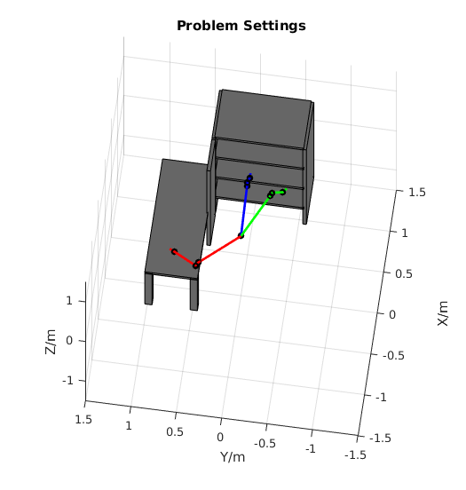
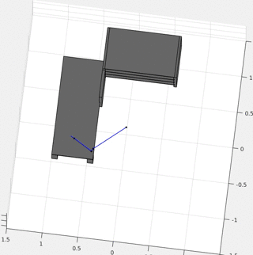

Example: A 3D replanning Matlab example
==================

One of the major advantages of using GPMP2 is that it provides a fast replanner using Bayes Tree, implemented by iSAM2 incremental smoother. 
We give an example using iSAM2 replanner here to solve a replanning problem,
which changes the goal configuration during the middle of the trajectory execution. 
We use the same environment and robot setting from [3D WAM arm example](../matlab/WAMPlannerExample.m). 
The full code can be found in [matlab/WAMReplannerExample.m](../matlab/WAMReplannerExample.m).

Example Replanning Problem
-----
The replanning problem we solve is *change goal configuration during middle of trajectory*, shown in Figure 1.
The original trajectory starts with the red configuration and ends with the blue configuration,
and is solved by GPMP2 BatchTrajOptimizer.
At 50% runtime of the trajectory, an updated goal configuration (in green) is given, and the trajectory
is be updated with a new goal.

|**Figure 1:** WAM arm replanning problem, with start (red), original end (blue) and re-directed end (green) configuration.|
|:-----------|
||

Original Trajectory
-----
We start with solving the original trajectory using [BatchTrajOptimize3DArm](../gpmp2/planner/BatchTrajOptimizer.h), initialized by a straight line. 
This step is the same as [3D WAM arm example](../matlab/WAMPlannerExample.m).
```matlab
% initial values by batch
init_values = initArmTrajStraightLine(start_conf, end_conf, total_time_step);
ori_traj_values = BatchTrajOptimize3DArm(arm, sdf, start_conf, start_vel, end_conf, ...
    end_vel, init_values, opt_setting)
```
```ori_traj_values``` contains the original optimized trajectory before replanning.

Initialize Replanner
------
Before any replanning tasks, an iSAM2 replanner [ISAM2TrajOptimizer3DArm](../gpmp2/planner/ISAM2TrajOptimizer.h) object is initialized
with original trajectory from Batch planner and optimization settings from [TrajOptimizerSetting](../gpmp2/planner/TrajOptimizerSetting.h).
```matlab
% isam init
isam_planner = ISAM2TrajOptimizer3DArm(arm, sdf, opt_setting);
% initial graph
isam_planner.initFactorGraph(start_conf, start_vel, end_conf, end_vel);
% insert original traj values
isam_planner.initValues(ori_traj_values);
% one update let isam accept original values
isam_planner.update();
```
There are three steps to initializing the iSAM2 replanner:

- Initialize factor graph by ```initFactorGraph```, with start and original end configuration/velocity.
- Initialize trajectory values by ``` initValues```, with original trajectory values.
- A single call ```update```, without any argument, lets iSAM2 process the factor graph and initial values to the Bayes tree.

After these steps the iSAM2 replanner is ready for replanning tasks.

Replanning
-----
The Solution of a replanning task during the middle of the trajectory execution has two more requirements besides being smooth and collision-free:

- The end system state satisfies given goal system state.
- The start system state is the same as current system state, since current state is *known* and *must not be violated*.

So the iSAM2 replanner needs new goal system state (configuration + velocity) and current system state

```matlab
% fix current conf and vel, update replanned end conf and vel
curr_conf = ori_traj_values.atVector(symbol('x', replan_pose_idx));
curr_vel = ori_traj_values.atVector(symbol('v', replan_pose_idx));
isam_planner.fixConfigAndVel(replan_pose_idx, curr_conf, curr_vel);
% update replanned end conf and vel
isam_planner.changeGoalConfigAndVel(replan_end_conf, end_vel);
% optimize! 
isam_planner.update();
% get results
replan_result = isam_planner.values();
```

There are four steps to perform a replanning task with iSAM2 replanner:

- Fix current configuration and velocity by ```fixConfigAndVel```, with current configuration/velocity and time stamp (here is state index). In the example, current time is 50% of total runtime, and the trajectory has total 10 steps, so we fix the state at index 5.
- Update trajectory goal configuration and velocity by ``` changeGoalConfigAndVel```.
- A single call to ```update```, lets iSAM2 update the Bayes tree.
- Get replanned trajectory in gtsam.Values by ```values```.

With consecutive replanning tasks, these steps can be performed repeatedly.

|**Figure 2:** WAM arm replanning results, with blue arms show the original trajectory before replanning, and red arms show the replanned trajectory.|
|:-----------|
| |
